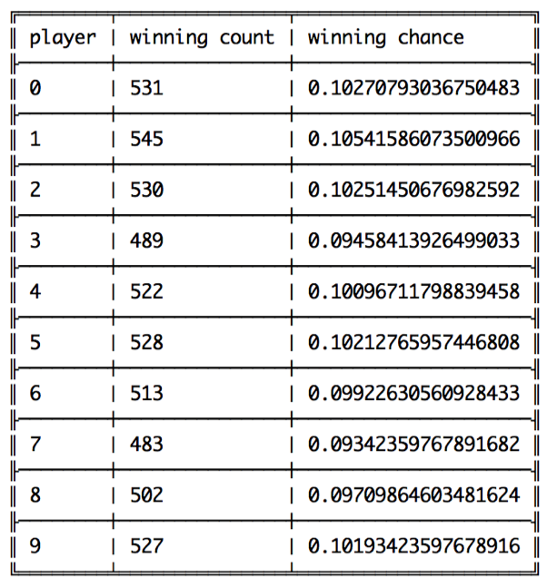

## Smart Contract Logic

In general for most applications, there are always 3 parties in the framework. Users, Smart Contract and EtherNet, so does our smart contract. As we know, the smart contract is running on the EVM which could be seen as a black box for developers and App users. So most of the interactions we care happens between users and the contract.

There are 4 stages or functions in this lottery contract — Initial, Buy, End, Lucky Draw. Most ordinary users only need to use the Buy function to participate in the game while only the lottery creator will call the initial function once to setup some basic attributes of this specific game instance. Attributes are like total time span of this game, beneficiary address, prize ratio. This transaction will return the game address. Then everyone can join the game by calling buy function, and sending their money (here using **ETH**) to the contract. All the money from user will added to the prize pool. When the end time comes, all the buy function will be disabled and any call of End function will trigger Lucky Draw function to calculate the winner and transfer the money to winner and beneficiary. After these process, the contract will be disabled but forever saved on the ethereum blockchain, and anyone can access its history data buy checking variables in this contract address.

Besides, here are some important attributes and principle of the contract. Firstly, the transactions can only be made within the lottery time span, once the lottery was ended, no one can make effective interaction with the contract anymore. This was controlled by a key attribute Ended. This attribute was forever changed to True once the End function was called. While all other functions are require this value to be False in advance, before the true logic was carried out. Such simple but strong mechanism ensure the basic security of the each round of the lottery game.

Secondly, the prize for winner and beneficiary are distributed upon the final balance of the contract and the pre-settled ratio by creator. Once the contract has finished its duty, it won't store any more money on it, and the whole transaction process is absolute transparent both in business aspect and technique aspect which is guaranteed by the fundamental mechanism of blockchain technology.

Finally, there is one principle of the winner selection, the more you purchase, the higher chance you will win. But we are still considering whether to introduce an additional constraints about the limitation on invest amount on such principle. That is because if a single user have taken the absolute main part among the total investment of this lottery, let's say 99% of the final balance, then it would almost be a predetermined result on the Lucky Draw. Obviously, the largest investor will win this game, which seems quite unfair for other participants. However, from beneficiary aspect, it does not change anything. Moreover, most reasonable users won't do such thing because even they win, due to the prize ratio deduction for beneficiary, such invest can result in negative gain and potential risk, although small, of losing all the money. Thus, we may add this feature as a selective option in production for the creator to decide.

## Winner Selection Logic

One of the most important thing people care in a lottery game is its randomness logic. It determines the fairness problem in the most direct way. A unbalanced, unfair winner selection method is even worse than the result manipulation. No one want to join a game like that in the very beginning. Therefore, considering its significance, we designed our winner selection logic carefully with both concern on the complete functionality as well as the performance impact.

This flow graph gives the underlie logic of winner selection and the mechanism of randomness in our contract. Firstly, each user holds their own purchases and nonce. The contract will arrange their winning probability according the ratio of money they invest and the total prize until the final moment. And then each user will be assigned a range of index logically in their purchase order, more precisely, the order of their transaction was confirmed in the network. Finally, whoever capture the final random number (winner index in the graph) will be the winner. Moreover, such random number is generated by the designed, although predetermined pseudo random algorithm. To add actual randomness in the lottery, all user's Nonce will be exclusive OR together with some other random value such as timestamp or blockIDs. And then, using this result as the input seed to the built-in SHA-256 algorithm to generate a bytes32 value, and cast it to int32 mod by the total balance. This integer value result is the winner index which help to local the winner finally.

### Fairness Proof

As mentioned above, fairness is crucial for the application, while the core of this part is the pseudo random function. Here we take the advantage of the Hash function, choosing the built-in Secure Hash Algorithm, and the specific version is SHA-256. To make sure the game is fair enough in the randomness, we have tested the contract more than 5,000 times in both balanced purchases and imbalanced purchases. The former one means each user purchase same amount of lottery in each round, while the latter one mease different user purchase different amount. The common part of these 2 scenarios is the random generated nonce for user comes from the built-in random package of Node.js.

We using `ganache-cli` as the backend private blockchain infrastructure. the start command and parameter is `nohup ganache-cli -s 6000 -p 7545 -a 10 -e 10000 2>&1 > ganache.log &` . The parameters simply mean the blockchain network startup with random seed as 6000, port at 7535 and 10 accounts with initial 10,000 ETH.

##### Balanced Purchases

In this scenario, each user purchase 0.5 ETH each time. After 5170 round of games, as the result shows, the winning chance of each user is roughly around 0.1. Hence, we believe the random number is uniformly distributed in certain degree.

##### Imbalanced Purchases

***<u>(need to update the pic)</u>***

In this scenario, the first 5 players purchase 0.1 ETH each time while the latter 5 players purchase 0.2 ETH which is as twice as the former ones. In theory, player 0~4 should have the chance of 6.66% to win while player 5~9 should have the probability of 13.32% to win. After many testing, we can see, the winning chance for these 10 players are distribute nearly as same as the calculated result. Thus, we believe fairness of the game is proven satisfied the requirements and the design.

Even with this much testing, before put the contract in production, there are more work and test need to be done. Such as analysis the influence on the winning chance from final balance and the number of users.

## Business Plan

We have a 2 stages development plan. We will spend the first 3 months to develop the product to have more functionality and better usability. Meanwhile, we will keep analyzing the market at same time. Then, in the next stage until the 6th month, we’ll reach out to the lottery companies, government and some welfare foundations to sell the platform and the support as well as the long-term development plan. Moreover, we can integrate their lottery plans into our Lottery Center DApp.

We’ll try to avoid high invest in the beginning. But we expect a stable income once the system is online. In the beginning stage, we'll form a 7 member team to do the system development and market popularize. That means except the initial 3 founders, we will need to hire 4 more people in total include 2 Blockchain & Back-End Developers, 1 Front-End & Dapp Developer and 1 Business Development Executive. After the system was online, the main income will come from the commission of the lottery for each round.

| Cost                                                         | Income                                                       |
| ------------------------------------------------------------ | ------------------------------------------------------------ |
| 1. Equipment cost : 50k HKD 2. Personnel cost : 25k * 4 * 3 3. Marketing cost : 50k HKD (Stage 2) | Decuction of each Lottery Game :  500k HKD / Month =  5% *  1M users / Month * 10 HKD / user |

As we expect 1 million users per month and each user will invest 10 HKD to the game, with 5% commision, the income would be around 500,000 HKD each month. While in Stage I, the Kickstart capital mainly comes from 3 co-founders each invest 150,000 HKD, and each own 21.4% shares. In Stage II, we will need to raise 250,000 HKD, and give 35.8% shares for investors.

| Stages   | Cost     | Income     | Revenue    |
| -------- | -------- | ---------- | ---------- |
| stage I  | 350k HKD | 0          | -350k HKD  |
| stage II | 350k HKD | 1,500k HKD | 1,150k HKD |

As the result, we expect the 1,150,000 HKD profit start fro Stage II.

## Improvements

However, LuckyYou is not matured enough. It needs improving in follow aspects. 

1. More playing modes. It is just able to select and buy the ticket in 
2. For now, each user can only buy once, we hope to extend to multiple times
3. Better random algorithm. A better random alg
4. lower interaction cost. - lower time complexity
5. Lottery List / A Fair Lottery Platform

